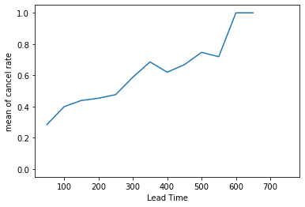
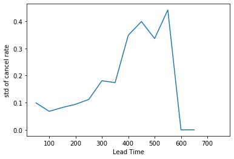
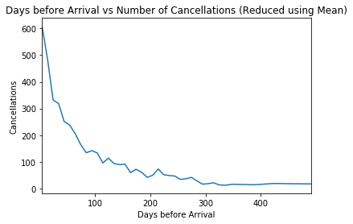
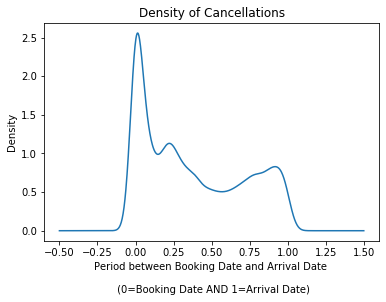

# Project: Predicting Hotel Booking Cancellations

Cancellations pose a problem to many businesses; hotels are among them. Using a dataset that contains booking details and the final status of the booking, can we learn more about booking cancellations? This project attemps to explore this.


## Installations

This project was done in Python 3.7.5 on a linux machine. here are the libraries necessary for the project:

* NumPy (>= 1.17.4)
* scikit-learn (>= 0.22.2)
* Pandas (>= 0.25.3)
* Matplotlib (>= 3.1.2)
    
### User installations

Pandas was used to throughout the project to read and manipulate the data and put it in a useful form to extract information needed or be fed to a machine learning model. To install Pandas, use pip or conda as follows:

```
pip install pandas
```
Or

```
conda install pandas
```


To answer one of the questions posed in this project, scikit-learn was used to build machine learning models. Specifically, linear and logistic regression models were used. To install scikit-learn, use pip or conda as follows:

```
pip install -U scikit-learn
```
Or

```
conda install scikit-learn
```


## Project Motivation

The idea behind this project is to identify whether there are patterns to hotel booking cancellations. Thus, Three closely related questions were asked and pursued to reach a conclusion. The project is meant to answer with data the following:


* Are bookings with longer lead time (days between date of reservation and date of arrival) more likely to be cancelled?

* How many days before arrival date do customers usually cancel their booking?

* Based on the features available in the data, can we predict whether a cancellation will occur or not?


## File Descriptions

Each question is pursued in a seperate notebook for order and easy navigation. they are conveniently named: 

* Q1.ipynb 
* Q2.ipynb 
* Q3.ipynb

The notebooks contain the methods utilized for answering the questions as well as stats and data visualizations 

##### Other files:

* hotel_bookings.csv: The dataset (which contains 32 columns and 119,390 samples)
* schema.txt: dataset columns and their description
* means_q1.png: data visualization for q1
* std_q1.png: data visualization for q1
* means_q2.png: data visualization for q2
* density_q2.png: data visualization for q2
* README.md: this file


## How to Interact with this project


Below are the questions, results, and the methods used to obtain the results:

1. Are bookings with longer lead time (days between date of reservation and date of arrival) more likely to be cancelled?

I attempted to graph lead time with respect the proportion of cancellations. Because there were many data points with sparse values I used a scatter plot, which showed an incresing trend. However, the graph looked too complex and harder to interpret so I took an average over every 50 value on the lead time axis, as well as a standard deviation. It yielded 2 graphs that were easier to interpret





the graphs definitively show that lower lead times have, on average, a lesser chance of being canceled. As lead time grows, customer becomes more complex and less predictable, as shown by the higher standard deviation.This means that a considerable portion of bookings with longer lead time have good chance of not being canceled. However, on average, these booking are more likely to be canceled.

2. How many days before arrival date do customers usually cancel their booking?

First, I attempted to get the difference in days of all canceled bookings. This value was the period remaining before arrival date. I took each period and counted the number of cancellations and then graphed the results. To improve the graph, I took an average of every 10 values and obtained the following graph:



However, this graph was not enough because it did not take lead time into account (the period between arrival date and actual booking). Thus, I took all the values and divided by lead time to obtain cancellation date as a ratio of lead time, e.g. cancellation at half lead time. I used a density graph to look the results.



As observed from the density graph above, cancellations mostly come on the DATE OF BOOKING itself and, to a lesser
extent, QUARTER WAY TO ARRIVAL DATE and on the ARRIVAL DATE. Hence, if a cancellation occurs, it will mostly occur
during these dates

3. Based on the features available in the data, can we predict whether a cancellation will occur or not?

A machine learning model was implemented to answer this question. I removed values that reveal the final status of the booking and handled categorical columns by adding dummy variables. One of the numeric columns (children) had missing values and a mean of 0.103. It didn't make sense to add this mean into the data, so the nans were replaced with 0. The model implemented was a logistic regression model

Here are the performance metrics of the model on test data:

- acc=0.8047295976770807
- recall= 0.607691731014319
- precision= 0.8215262997871694
- f1-score = 0.6986124278203913

I also used a linear model, with values <0.5 interpreted as 1 and >=0.5 as 0. the results were similar:

- acc=0.8042828824301309
- recall= 0.5890246645175801
- precision= 0.8371870005327651
- f1 score= 0.691515578243267

The results show that it's possible to predict cancellations with a reasonable degree of confidence

This project might be of interest to hotel owners, booking apps, or individuals who are curious about booking cancellation patterns Further inquiry can be made about cancellations. The results can be further broken down to get more insights out of the data.


## Acknowledgements

The dataset was obtained from Kaggle (link: https://www.kaggle.com/jessemostipak/hotel-booking-demand)
